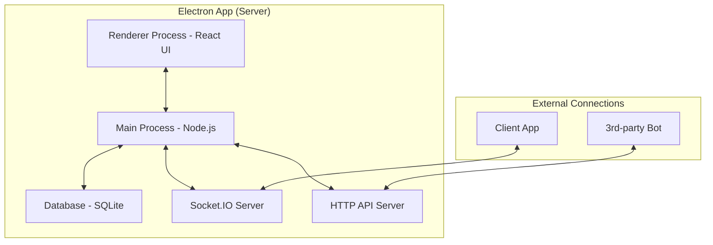

# Cybercafe Management System - Server

## Tổng quan
Đây là hệ thống quản lý Cybercafe hiện đại, được xây dựng với Electron, TypeScript, TypeORM và React (thông qua Vite). Nó cung cấp một dashboard quản trị toàn diện để quản lý khách hàng, phiên chơi, giao dịch, và nhiều hơn nữa. Hệ thống được thiết kế để đạt hiệu suất cao, có khả năng phục hồi và mang lại trải nghiệm người dùng liền mạch.

## Kiến trúc hệ thống

### Kiến trúc tổng quan

Hệ thống bao gồm một ứng dụng Electron đóng vai trò là server, xử lý tất cả logic nghiệp vụ và giao tiếp với cơ sở dữ liệu. Giao diện người dùng được xây dựng bằng React và chạy trong tiến trình Renderer của Electron.



### Luồng dữ liệu và quản lý trạng thái

Hệ thống sử dụng kiến trúc dựa trên sự kiện (event-driven) để đảm bảo tính nhất quán và hiệu suất. **Zustand** được sử dụng làm thư viện quản lý trạng thái toàn cục ở phía admin.

1.  **Nguồn chân lý (Single Source of Truth):**
    -   Cơ sở dữ liệu (SQLite) là nguồn lưu trữ dữ liệu chính.
    -   Store Zustand ở phía admin (Renderer) giữ một bản sao của trạng thái cần thiết cho giao diện, đảm bảo UI luôn phản ánh đúng dữ liệu mới nhất.

2.  **Luồng cập nhật dữ liệu (Create/Update/Delete):**
    -   **Lệnh (Command):** Giao diện người dùng gửi một "lệnh" thông qua IPC đến Main Process (ví dụ: `customers:create`).
    -   **Xử lý:** Main Process thực hiện logic nghiệp vụ, cập nhật cơ sở dữ liệu.
    -   **Sự kiện (Event):** Sau khi xử lý xong, Main Process phát một "sự kiện" qua Socket.IO đến tất cả các client admin (ví dụ: `customer:created` hoặc `customer:updated`) cùng với đối tượng dữ liệu đã được cập nhật đầy đủ.
    -   **Cập nhật State:** Store Zustand lắng nghe sự kiện này và cập nhật trạng thái của nó. React sẽ tự động render lại các thành phần bị ảnh hưởng.

    *Ưu điểm của luồng này là giao diện không cần biết về logic xử lý, nó chỉ cần phản ứng với các sự kiện, giúp mã nguồn sạch sẽ và dễ bảo trì.*

3.  **Luồng tải dữ liệu khách hàng (Tối ưu hóa):**
    -   Để tránh "vấn đề N+1" và đảm bảo hiệu suất, hệ thống không truy vấn thông tin cho từng khách hàng một.
    -   Khi trang khách hàng được tải, nó thực hiện một yêu cầu duy nhất `customers:getAllDetails`.
    -   Backend sẽ thực hiện **3 truy vấn hiệu quả** để lấy tất cả dữ liệu: một cho thông tin cơ bản của khách hàng, một để tổng hợp tổng chi tiêu, và một để tổng hợp tổng giờ chơi. Dữ liệu sau đó được kết hợp và trả về trong một gói duy nhất.

4.  **Quản lý phiên chơi (Session Management) thời gian thực:**
    -   **Nguồn chân lý ở Server:** `SessionManagerService` trên Main Process là nơi quản lý thời gian chơi còn lại (`time_remaining`) của tất cả các phiên đang hoạt động. Nó chạy một bộ đếm mỗi giây.
    -   **Đồng bộ định kỳ:** Server gửi sự kiện `session:update` đến client (cả app khách hàng và admin) mỗi 10 giây để đồng bộ thời gian và số dư, đảm bảo dữ liệu luôn chính xác.
    -   **Lưu trữ khi kết thúc:** Khi một phiên kết thúc (đăng xuất hoặc hết giờ), `time_remaining` cuối cùng được lưu vào bảng `customers`.
    -   **Phục hồi sau sự cố:** Khi server khởi động lại, nó sẽ tự động tính toán và khôi phục lại thời gian chơi cho các phiên còn hoạt động.

5.  **Xác thực phiên (Session Validation):**
    -   Khi ứng dụng client khởi động, nó sẽ gửi `userId` đã lưu để server xác thực. Nếu phiên không hợp lệ trên server, client sẽ tự động đăng xuất.

## Database
Hệ thống sử dụng **SQLite** và **TypeORM**.

- **Models**: `Customer`, `Transaction`, `Session`, `SystemLog`, `CustomerLog`.
- `CustomerLog`: Ghi lại các hoạt động của khách hàng (đăng nhập, đăng xuất, nạp tiền).
- `SystemLog`: Ghi lại các sự kiện của hệ thống (khởi động, lỗi, thay đổi cấu hình).

## Features
- **Admin Dashboard**: Giao diện quản lý khách hàng, theo dõi trạng thái online, và xem chi tiết hoạt động.
- **Quản lý khách hàng hiệu suất cao**: Tải và hiển thị danh sách khách hàng cực nhanh nhờ truy vấn CSDL được tối ưu hóa.
- **Cập nhật giao diện thời gian thực**: Sử dụng kiến trúc dựa trên sự kiện với Socket.IO và Zustand để cập nhật giao diện ngay lập tức mà không cần tải lại trang.
- **Quản lý phiên thời gian thực**: Theo dõi thời gian chơi chính xác từ server, tự động chuyển đổi số dư thành thời gian, và tự động đăng xuất.
- **Phục hồi sau sự cố Server**: Tự động khôi phục các phiên đang hoạt động nếu server khởi động lại, đảm bảo không mất dữ liệu thời gian chơi.
- **Xác thực phiên an toàn**: Đảm bảo trạng thái đăng nhập của client luôn nhất quán với server.
- **Hệ thống ghi log toàn diện**: Ghi lại mọi hoạt động của khách hàng và sự kiện hệ thống.
- **API cho Bot**: Cung cấp các endpoint HTTP cơ bản cho các bot bên ngoài để nạp tiền và tương tác.

## Project Structure
```
cybercafe-desktop/
└── server/
    ├── release/             # Chứa file cài đặt sau khi build
    ├── installer/           # Script cho trình cài đặt
    └── src/
        ├── main/
        │   ├── ipcHandlers/ # Các file xử lý lệnh từ IPC (customers, topup,...)
        │   ├── models/      # Models của TypeORM
        │   ├── services/    # Logic nghiệp vụ (database, auth, session, logging,...)
        │   └── main.ts      # Điểm vào của Electron Main Process
        └── renderer/
            ├── components/  # Các component React UI
            ├── pages/       # Các trang React
            ├── services/    # Các service phía renderer (gọi IPC)
            ├── stores/      # Trạng thái toàn cục (Zustand)
            ├── lib/         # Thư viện, tiện ích
            └── styles/      # CSS, Tailwind
```

## Công nghệ sử dụng
- **Electron**
- **Vite** (Build tool cho React)
- **React**
- **TypeScript**
- **SQLite** (Database)
- **TypeORM** (ORM)
- **Socket.IO** (Giao tiếp thời gian thực)
- **Express** (HTTP API cho bot)
- **Zustand** (Quản lý trạng thái)
- **Tailwind CSS**

## Cài đặt và Chạy
1. **Cài đặt dependencies:**
   ```bash
   npm install
   ```
2. **Chạy ở chế độ development:**
   Lệnh này sẽ khởi chạy cả Main Process và Renderer Process (với hot-reload).
   ```bash
   npm run dev
   ```
3. **Build ứng dụng:**
   ```bash
   # Build ứng dụng cho nền tảng hiện tại
   npm run build
   ```
4. **Tạo bộ cài đặt:**
   Lệnh này sẽ build ứng dụng và đóng gói vào một file cài đặt (ví dụ: `.exe` cho Windows). File cài đặt sẽ nằm trong thư mục `release`.
   ```bash
   npm run make
   ```
## API cho Bot
Các bot bên ngoài có thể tương tác với hệ thống thông qua HTTP API:
- `POST /api/topup/notify`: Xử lý thông báo nạp tiền. Dữ liệu gửi lên: `{ "username": "...", "amount": ..., "message": "..." }`

---
Feel free to contribute or customize for your own cybercafe or gaming lounge!
